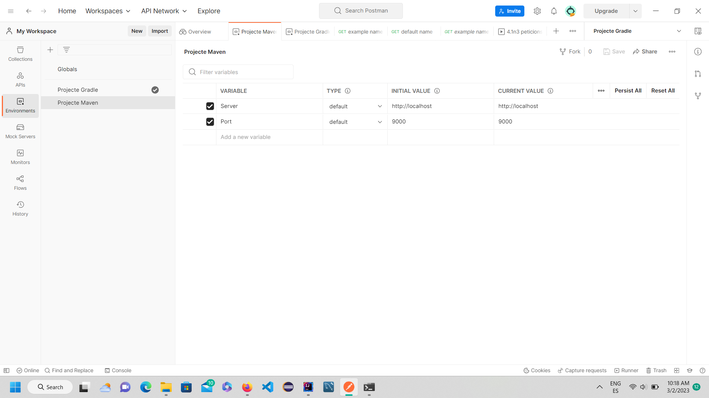
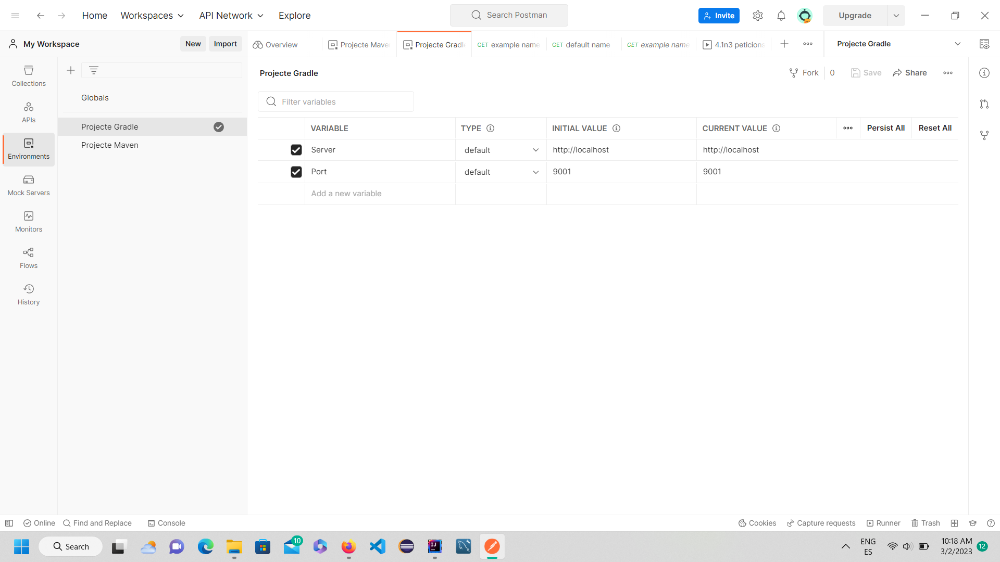
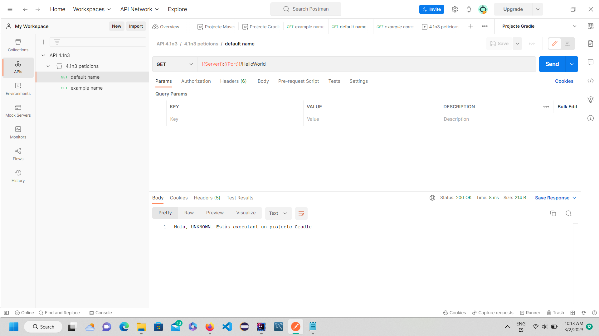
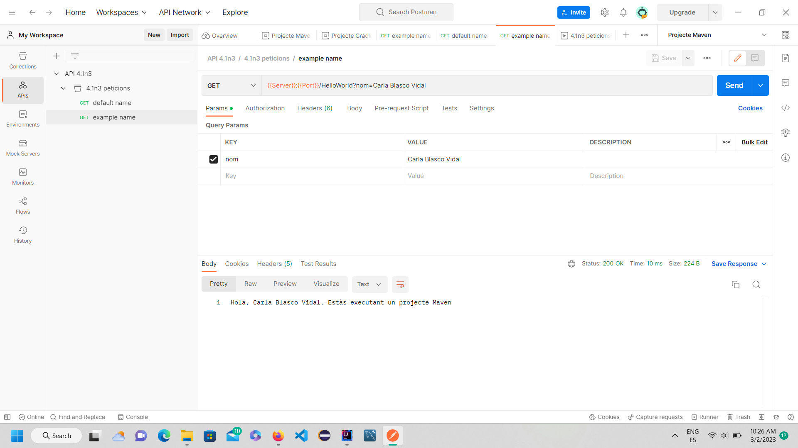

# Sprint4
4.1 Introducció a Spring i 4.2 API Rest amb Spring boot

Postman amb projectes amb Maven i Gradle
Environments:

Peticions:
(amb default value i Projecte Gradle) 

(amb given value i Projecte Maven)

